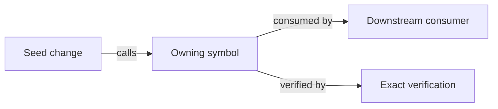
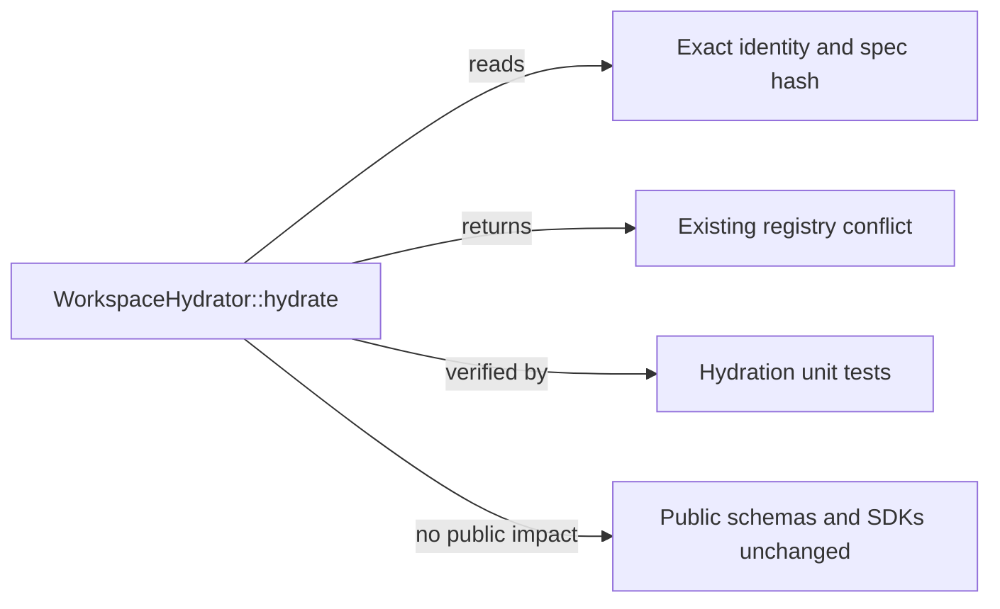

# Canonical Wyrd Implementation Plan

Use this exact ordered format for
`.dev/plan/<slug>/implementation-plan.md`. The canonical plan owns feature
decisions and compiles them into separate executable task packets.

## Contents

- [Metadata](#metadata)
- [Required plan body](#required-plan-body)
- [Implementation tasks](#implementation-tasks)
- [Verification and closeout](#verification-and-closeout)
- [Compact example](#compact-example)
- [Readiness audit](#readiness-audit)
- [Artifact lifecycle](#artifact-lifecycle)

## Metadata

````markdown
# <Outcome-oriented title>

Status: Draft | Review Required | Approved
Repository: wyrd
Planner: Sol
Implementation models: <comma-separated subset of Terra, Luna, Sol>
Created: YYYY-MM-DD
Last updated: YYYY-MM-DD
Plan version: 1
Evidence snapshot: <branch> at <7-40 hex HEAD>; <relevant working-tree state>
Review: <not required | required | .dev/review/<review-id>/review.md>
Execution skill: $wyrd-implement
```

Use `Draft` while intent or material design is open. Use `Review Required`
when the risk gate applies. Use `Approved` only after the readiness audit and
required independent review. List the execution skill or skill set required by
the plan's task write sets.

## Required plan body

Use these headings in this order. Do not rename, reorder, merge, or omit them.
When a section is inapplicable, write
`Not applicable: <one-sentence reason>`.

```markdown
## Objective

State the user or agent outcome and observable success.

## Current state and evidence

### Verified
- Current behavior, owners, source seams, callers, and tests.

### Change-impact graph



Use concrete repository nodes and labelled edges. Cover owners, callers,
dispatch, manifests/features/targets, generated or language surfaces,
persistence/audit/tenancy/lifecycle/deployment, and verification dependencies.
Represent an inapplicable category with an explicit `no impact` node or an
evidence-backed note immediately after the graph.

### Assumptions
- Safe assumptions visible to implementation.

### Unknowns
- Must be empty or explicitly non-material before approval.

### Execution discoveries
- Append implementation-time factual corrections and bounded mechanical
  adaptations. Do not rewrite requirements or material decisions.

## Requirements

- R1. Observable behavior.
- R2. Observable behavior.

## Non-goals

- Adjacent work that must not enter the change.

## Constraints

- Compatibility, deployment, dependency, feature, scope, or operational
  boundaries.

## Architecture and design decisions

- Stable decision IDs when later tasks or review need to cite them.
- Chosen owners and dependency direction.
- Rejected alternatives only when likely to be reconsidered.

## Domain and data contracts

- Required types, fields, variants, wire/storage shapes, and invariants.

## Interfaces and function contracts

- Required methods, functions, inputs, outputs, visibility, errors, ownership,
  and compatibility.
- Typed stubs for new or materially changed interfaces.

## Control flow and pseudocode

- Normative pseudocode for consequential ordering, transactions, state
  transitions, side effects, and error mapping.

## Failure and edge-case matrix

- Compact matrix covering the material negative, duplicate, concurrent,
  partial-progress, cancellation, migration, and recovery cases.

## Milestones

- Independently verifiable vertical milestones where the feature needs them.

## Task inventory

- Every implementation task, assigned model, requirements, dependencies, and
  packet location.

## Global acceptance criteria

- Feature-wide observable and compatibility outcomes.

## Verification strategy

- Requirement-to-task-to-proof matrix and focused task policy.

## Closeout verification

- Exact integrated commands, feature policy, order, and final evidence.

## Risks, migration, and rollout

- Include only when the change creates material operational or compatibility
  risk.

## Execution handoff

- Ordered task sequence, `$wyrd-implement` invocation contract, and the
  conditions that return work to plan-level authority.
- State that `$wyrd-implement-plan` serializes implementation and review.
````

For a small localized change, use
`Not applicable: <one-sentence reason>` in sections such as migration or
rollout. Do not omit, merge, or rename sections.

## Implementation tasks

Every plan contains at least one separate task packet conforming to
`task-packet-format.md`.

Use a task inventory:

| Task | Outcome | Requirements | Model | Depends on | Packet |
|---|---|---|---|---|---|
| T1 | Cohesive result | `R1` | Terra | None | `tasks/01-result.md` |

Link every task file from the inventory. Task files inherit the approved plan
but remain directly executable without the planning conversation.

Do not mark a task `Ready` until the plan is `Approved`.
Before marking it `Ready`, execution-check its commands and pass a cold
read-only implementation rehearsal as defined by the planner skill.

## Verification and closeout

Map every requirement:

| Requirement | Task | Implementation evidence | Verification | Result needed |
|---|---|---|---|---|
| `R1` | `T1` | Named owner and behavior | Named test and live command | Pass |

For each task, define:

- affected crates, packages, modules, and dependent surfaces;
- required tests and the behavior each proves;
- exact focused commands in sequential order;
- required default or optional features and their reason;
- broad commands that task must not run;
- completion evidence.

For the complete plan, define:

- integrated tests and user journeys;
- format, lint, typecheck, codegen, schema, docs, migration, and boundary gates;
- the all-feature workspace closeout;
- whether `pre-pr` is required and why;
- final diff and requirement traceability audit.

## Compact example

This example is illustrative, not current Wyrd authority:

````markdown
# Return typed hydration conflicts

Status: Approved
Repository: wyrd
Planner: Sol
Implementation models: Terra, Luna
Created: 2026-07-29
Last updated: 2026-07-29
Plan version: 1
Evidence snapshot: feature/cards at 0123456789ab; unrelated UI changes present
Review: not required
Execution skill: $wyrd-implement

## Objective

Return a typed conflict when a hydrated workspace contains two incompatible
versions of the same exact Card identity, without changing successful hydration.

## Current state and evidence

### Verified

- `WorkspaceHydrator::hydrate` owns workspace hydration.
- Duplicate insertion currently maps through the generic registry error.
- Existing tests cover successful multi-card hydration but not conflicts.

### Change-impact graph



### Assumptions

- The existing public error catalog has an appropriate conflict family.

### Unknowns

- None.

### Execution discoveries

- None at approval.

## Requirements

- R1. Incompatible duplicate identity returns one stable typed conflict.
- R2. Identical duplicate input remains idempotent.
- R3. Successful hydration behavior remains unchanged.

## Non-goals

- No registry schema or Card identity redesign.
- No new retry behavior or public route.

## Constraints

- Reuse the existing hydrator owner and error derive.
- Default features only; no new dependencies.

## Architecture and design decisions

### D1: Detect conflicts at insertion

`WorkspaceHydrator` compares the incoming immutable spec hash with the entry
already indexed under the exact identity. Equal hashes reuse the entry;
different hashes return the stable conflict before relationships are derived.

Rejected: a second validation pass after relationship derivation, because it
would perform work against an invalid workspace and obscure the owning seam.

## Domain and data contracts

No new public domain type. The existing exact Card identity and immutable spec
hash remain authoritative.

## Interfaces and function contracts

No new public interface. `WorkspaceHydrator::hydrate` retains its signature and
returns the existing typed registry conflict. A private helper is permitted
only if it keeps duplicate classification clearer than an inline comparison.

## Control flow and pseudocode

Normative behavior; helper structure is illustrative:

    for card in input:
        identity = exact_identity(card)
        if identity absent:
            insert card
        else if existing.spec_hash == card.spec_hash:
            reuse existing
        else:
            return typed hydration conflict
    derive relationships
    return workspace

## Failure and edge-case matrix

| Condition | Behavior | Requirement |
|---|---|---|
| New identity | Insert | R3 |
| Same identity and hash | Reuse | R2 |
| Same identity, different hash | Typed conflict; no workspace returned | R1 |

## Milestones

- M1: Complete T1 and its focused verification.

## Task inventory

| Task | Outcome | Requirements | Model | Depends on | Packet |
|---|---|---|---|---|---|
| T1 | Hydrator returns the typed conflict with regressions | R1–R3 | Terra | None | `tasks/01-hydration-conflict.md` |

## Global acceptance criteria

- R1–R3 pass through focused hydrator tests.
- No public schema, dependency, or feature change.

## Verification strategy

| Requirement | Task | Proof | Command |
|---|---|---|---|
| R1 | T1 | Conflicting duplicate unit test | Focused `wyrd-registry` test |
| R2 | T1 | Identical duplicate unit test | Focused `wyrd-registry` test |
| R3 | T1 | Existing hydration regression | `mise run test:shared` |

Task verification uses default features and excludes all-feature and `pre-pr`
commands.

## Closeout verification

- Run the task commands, then `mise run check`.
- `pre-pr` is not required because no shared CI or build infrastructure changes.

## Risks, migration, and rollout

Not applicable: the change is synchronous, in-memory, non-public, and has no
durable migration or deployment transition.

## Execution handoff

Execute `tasks/01-hydration-conflict.md` with `$wyrd-implement`. Return to
planning if the existing identity/hash seam or typed conflict does not exist.
````

`tasks/01-hydration-conflict.md` must include the complete task structure,
concrete paths and symbols, stubs or pseudocode, acceptance criteria, required
tests, commands, exclusions, escalation conditions, and completion report.

## Readiness audit

Before presenting or approving:

- [ ] Objective and primary workflow are unambiguous.
- [ ] Verified facts, assumptions, and unknowns are separated.
- [ ] A concrete change-impact graph traces the seed change through owners,
      callers/dispatch, build/test surfaces, generated or language projections,
      operational concerns, and verification.
- [ ] Every requirement maps to implementation and objective verification.
- [ ] Non-goals and constraints prevent plausible scope expansion.
- [ ] Architecture, owners, dependency direction, and compatibility are fixed.
- [ ] Required types, interfaces, responsibilities, and invariants are stubbed.
- [ ] Consequential control flow and failures are explicit.
- [ ] Every plan has at least one complete separate task packet.
- [ ] Every task fits its assigned Luna, Terra, or Sol model and never requires
      reasoning above `high`.
- [ ] Every task names scope, symbols, tests, commands, features, exclusions,
      escalation, and evidence.
- [ ] Task dependencies leave coherent integration boundaries.
- [ ] User journeys cover every shipped public surface.
- [ ] Closeout uses current repository commands without unjustified repetition.
- [ ] Every task command, target, feature, filter, fixture, support export, and
      repository-managed setup was execution-checked.
- [ ] Every `Ready` task passed documented cold read-only implementation
      rehearsal, using a fresh agent when available.
- [ ] Each task uses `$wyrd-implement`, stays in the foundation write set, and
      can execute without a material design choice.
- [ ] Any required independent review returned `Approve`.

The plan content is the evidence; do not copy the checklist into the artifact
unless its state helps execution.

## Artifact lifecycle

- When mutation is prohibited, present one `<proposed_plan>` block containing
  complete artifacts in this order:
  `<!-- artifact: implementation-plan.md -->`, then each
  `<!-- artifact: tasks/<NN>-<task-slug>.md -->`. Each marker is followed by
  the artifact's normal outcome-oriented level-one title and complete content.
- Save an authorized plan at
  `.dev/plan/<slug>/implementation-plan.md`.
- Save every packet under `.dev/plan/<slug>/tasks/`.
- Update the canonical plan on revision instead of appending a competing plan.
- During execution, append factual discoveries under `Execution discoveries`
  and bounded task updates under the task's `Completion evidence`.
- Keep requirements, public or persisted contracts, security and tenancy
  semantics, data-loss behavior, material architecture, and acceptance
  outcomes stable within one bounded task. Return to plan-level authority when
  one must change; `$wyrd-implement-plan` may revise them under its autonomous
  orchestrator contract.
- Do not create progress ledgers, run directories, duplicate specs, or
  completion sentinels.
